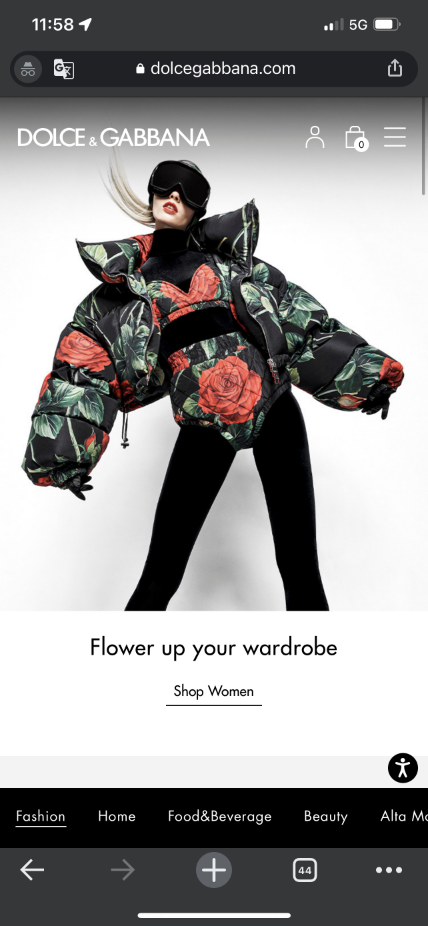
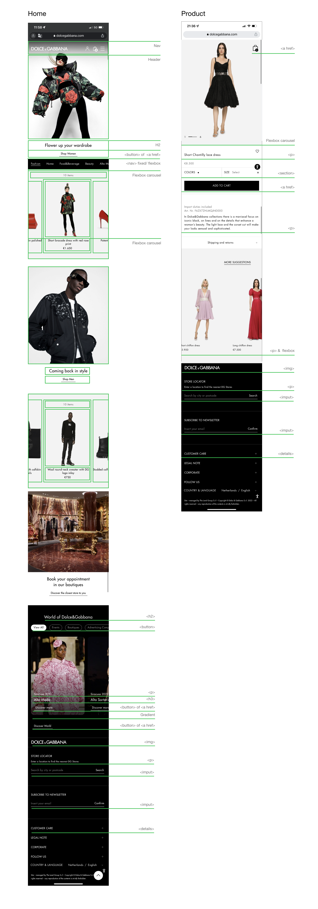

# Procesverslag
Markdown is een simpele manier om HTML te schrijven.  
Markdown cheat cheet: [Hulp bij het schrijven van Markdown](https://github.com/adam-p/markdown-here/wiki/Markdown-Cheatsheet).

Nb. De standaardstructuur en de spartaanse opmaak van de README.md zijn helemaal prima. Het gaat om de inhoud van je procesverslag. Besteedt de tijd voor pracht en praal aan je website.

Nb. Door *open* toe te voegen aan een *details* element kun je deze standaard open zetten. Fijn om dat steeds voor de relevante stuk(ken) te doen.

## Jij

  ### Auteur:
  Betoel Fadallah

  #### Je startniveau:
  blauw/ rood piste.

  #### Je focus:
  ---- (kies uit responsive óf surface plane.)
  Mijn focus ligt op surface plane, als ik tijd over hou werk ik eventueel verder naar responsive toe. 

## Je website

  ### Je opdracht:
  https://www.dolcegabbana.com/en/
  
  Ze hebben ondertussen meerdere aanpassingen doorgevoerd qua opmaak. Wel heb ik een Adobe XD file met daarin screenshots van de schermen die ik zoveel mogelijk probeer te realiseren.

  Home pagina
  https://xd.adobe.com/view/23c7a785-c879-4b20-b483-35677b092a51-7694/

  Product pagina
  https://xd.adobe.com/view/d734fb4d-3832-4a4a-a09f-64595f895792-8267/
  
  #### Screenshot(s) van de eerste pagina (small screen): 
  Home   
  

  #### Screenshot(s) van de tweede pagina (small screen):
  hier de naam van de pagina  
  
 

## Toegankelijkheidstest 1/2 (week 1)

  
uitwerken na test in 1e werkgroep

  ### Bevindingen
  Lijst met je bevindingen die in de test naar voren kwamen:

  Voor het onderzoeksfase heb ik samen met Leanne aantal verschillende testen uitgevoerd op de site om zo te achterhalen welke beperkingen en belemmeringen bepaalde doelgroepen wellicht tegenaan lopen. We hebben daarvoor verschillende visuele testen voor wat betreft zicht en beeld die verschillende gebruikers ervaren maar ook fysieke obstakels, denk aan typen op het toetsenbord waarbij elastiekjes om de vingers zijn gevestigd. Zo hebben we ook ervaren welke handelingen het lastiger maakt voor sommige gebruikers en konden we daardoor beter inleven. Er zijn 3 hoofd testen uitgevoerd:

  1. Blur/Glare Cataract #200776 werd als een groot belemmering ervaren. Overgroot deel van de teksten waren niet goed leesbaar en koste de gebruiker (Leanne) meer tijd om ze te herkennen. Deze gebruiker kan beter gebruik maken van gehoor, want op beeld kun je helaas niet rekennen... 
  

  2. Low contrast bril #0778P van Optelec.com zorgde voor weinig tot geen belemmering. Voordeel van Dolce & Gabbana site (afgekort DC) is dat overgroot deel van de huisstijl en huidige campagne die gevoerd word sterk in contrast is en met name zwart/ wit.
  

  3. Peripheral Field Loss #0775P zorgde voor een redelijke tot grote belemmering voor de gebruiker. Zicht over de site was matig, maar dit kwam voornamelijk door de beperkte beeld en de hoeveelheid breedte de gebruiker kon waarnemen. Knoppen waren lastiger te spotten, ook omdat DC aanzienlijk kleinere knoppen heeft dan een gemiddelde site.
  

  4. Ballon voor ADHD en gebruikers met slechte concentratie span, was de site wel prima te bedienen. Visueel waren er geen belemmeringen. En over het algeel kan de gebruiker door de 2 losse navigatie balken(3 eigenlijk) sneller producten vinden door de geavanceerde menu opties die gecategoriseerd zijn.
  

  5.   

  #### Screenreader
  Hier korte omschrijving (met indien nodig afbeeldingen)

  Over het algemeen is het wel prima, op sommige afbeeldingen lijkt het soms onnodige data te benoemen, of informatie die eerder is benoemd aan de hand van de kopjes.

  Hier een omschrijving van hoe het opgelost kan worden (met indien nodig afbeeldingen)

  Hoe dit opgelost kan worden is door bijvoorbeeld afbeel

  #### Muis en Toetsenbord 
  Hier korte omschrijving (met indien nodig afbeeldingen)

  Hier een omschrijving van hoe het opgelost kan worden (met indien nodig afbeeldingen)

  #### Motoriek (shocks, elastiekjes)
  Hier korte omschrijving (met indien nodig afbeeldingen)

  Hier een omschrijving van hoe het opgelost kan worden (met indien nodig afbeeldingen)

  #### Visueel (brillen, contrast, kleurenblind, dark/light). 
  Hier korte omschrijving (met indien nodig afbeeldingen)

  Hier een omschrijving van hoe het opgelost kan worden (met indien nodig afbeeldingen)

## Breakdownschets (week 1)

  
uitwerken na afloop 2e werkgroep

  ### de hele pagina: 
  

  ### dynamisch deel (bijv menu): 
  

  ### wellicht nog een dynamisch deel (bijv filter): 

## Voortgang 1 (week 2)

  
uitwerken voor 1e voortgang

  ### Stand van zaken
  hier dit ging goed & dit was lastig (neem ook screenshots op van delen van je website en code)

  ### Agenda voor meeting
  samen met je groepje opstellen

  | student 1 Tijn     | student 2  Daphne        | student 3  Leanne  | student 4  Betoel (ik)      |
  | ---            | ---                | ---          | Is de basis van mijn html goed? |
  | dit bespreken  | en dit             | en ik dit    | Hoe pak ik de 3 navigaties aan?    |
  | en dat ook nog | dit als er tijd is | nog een punt | Is de huidige section verdeling goed? |
 

  ### Verslag van meeting
  hier na afloop snel de uitkomsten van de meeting vastleggen

  - ul mag ook los gebruikt worden hoeft niet altijd in een section. 
  - button tag vervangen met a href aangezien ze qua styling er ook zo uitzien.

  /////////////ZIE DOCUMENTATIE IN DOCS - NIET VERGETEN HIERIN TOEVOEGEN

## Voortgang 2 (week 3)

  
uitwerken voor 2e voortgang

  ### Stand van zaken
  hier dit ging goed & dit was lastig (neem ook screenshots op van delen van je website en code)

  ### Agenda voor meeting
  samen met je groepje opstellen

  | student 1 Jade      | student 2  Daphne        | student 3 Leanne   | student 4  Betoel (ik)      |
  | ---            | ---                | ---          | ---              | Hoe kan ik een openklapbare nav maken in js?
  | dit bespreken  | en dit             | en ik dit    | en dan ik dat    | Css carousel effect
  | en dat ook nog | dit als er tijd is | nog een punt | dit wil ik zeker |
  | ...            | ...                | ...          | ...              |

  ### Verslag van meeting
  hier na afloop snel de uitkomsten van de meeting vastleggen

  - Een werkende nav met ondersteuning van Sanne
  - Hoe je een gradient kunt toevoegen aan een afbeelding en eventuele effecten
  - Css nog verder ordenen.

/////////////ZIE DOCUMENTATIE IN DOCS - NIET VERGETEN HIERIN TOEVOEGEN

## Toegankelijkheidstest 2/2 (week 4)

  
uitwerken na test in 8e werkgroep

  ### Bevindingen
  Lijst met je bevindingen die in de test naar voren kwamen (geef ook aan wat er verbeterd is):

  #### Screenreader
  Hier korte omschrijving (met indien nodig afbeeldingen)

  Hier een omschrijving van hoe het opgelost kan worden (met indien nodig afbeeldingen)

  1. Logo leest alle onnodige data, dus de alt tekst en logo naam moet gewijzigd.  
  2. Navigatie 1 & 2 leest hij wel volledig. Alhoewel de eerste navigatie klapt hij niet open bij het benoemen van de linkjes.
  3. Carousels worden wel goed benoemd, afbeelding en teksten zijn samengevoegd waarbij de alt teksten niet worden voorgelezen.
  4. Section 4 word benoemd als section 3.
  5. Input form word wel herkend, alleen ontbreken de placeholder teksten.

  #### Muis en Toetsenbord 
  Hier korte omschrijving (met indien nodig afbeeldingen)

  Hier een omschrijving van hoe het opgelost kan worden (met indien nodig afbeeldingen)

  #### Motoriek (shocks, elastiekjes)
  Hier korte omschrijving (met indien nodig afbeeldingen)

  Hier een omschrijving van hoe het opgelost kan worden (met indien nodig afbeeldingen)

  #### Visueel (brillen, contrast, kleurenblind, dark/light). 
  Hier korte omschrijving (met indien nodig afbeeldingen)

  Hier een omschrijving van hoe het opgelost kan worden (met indien nodig afbeeldingen)
  ----Dit nog uitwerken

  1. Trichroacy normaal - prima
  2. Blue cone - contrast is gewoon prima, teksten zijn goed leesbaar.
  3. Monochromacy - zwart wit contrast is prima misschien linkjes met shop man 
  4. Greenweak - contrast is goed 
  5. Green- blind - zelfde
  6. Red weak - geen effecten
  7. Red blind - geen belemmeringen
  8. Blue weak - alles in het rood net als de huisstijl dus geen grote effecten
  9. Blue blind - zelfde als 8

  1. Low contrast - alles is wazig button/ linkjes mogen groter
  2. Color #0779P
  3. Hemifield loss #0777P
  4. Central field loss AMD #200774
  5. Combined loss Diabetic Eyes Disease #200773

## Voortgang 3 (week 4)

  
uitwerken voor 3e voortgang

  ### Stand van zaken
  hier dit ging goed & dit was lastig (neem ook screenshots op van delen van je website en code)

  ### Agenda voor meeting
  samen met je groepje opstellen

  | student 1 Tijn     | student 2   Daphne       | student 3  Leanne  | student 4   Betoel (ik)     |
  | ---            | ---                | ---          | ---              | Hoe kan je een carousel in een oneindige loop coderen?
  | dit bespreken  | en dit             | en ik dit    | en dan ik dat    | Nav aanvullen met iconen?
  | en dat ook nog | dit als er tijd is | nog een punt | dit wil ik zeker |
  | ...            | ...                | ...          | ...              |

  ### Verslag van meeting
  hier na afloop snel de uitkomsten van de meeting vastleggen

  - Details tag gebruiken bij de footer om het plusje te kunnen maken.
  - Nav verbeteren mbt responsiveness
  - Hoe maak je een carousel in een oneindige loop? - blijkbaar is dit wel een lastige oplossing, dus verder niet besproken tijdens de meeting.
  - Nav in ul stoppen als je  iconen wilt aanvullen.

  /////////////ZIE DOCUMENTATIE IN DOCS - NIET VERGETEN HIERIN TOEVOEGEN

## Eindgesprek (week 5)

  
uitwerken voor eindgesprek

  ### Je uitkomst - karakteristiek screenshots:
  

  ### Dit ging goed/Heb ik geleerd: 
  Korte omschrijving met plaatjes

  

  ### Dit was lastig/Is niet gelukt:
  Korte omschrijving met plaatjes

  

## Bronnenlijst

  
continu bijhouden terwijl je werkt

  Nb. Wees specifiek ('css-tricks' als bron is bijv. niet specifiek genoeg).

  1. https://css-tricks.com/snippets/css/a-guide-to-flexbox/
  2. https://stackoverflow.com/questions/16211326/could-i-use-a-in-ul-around-li

